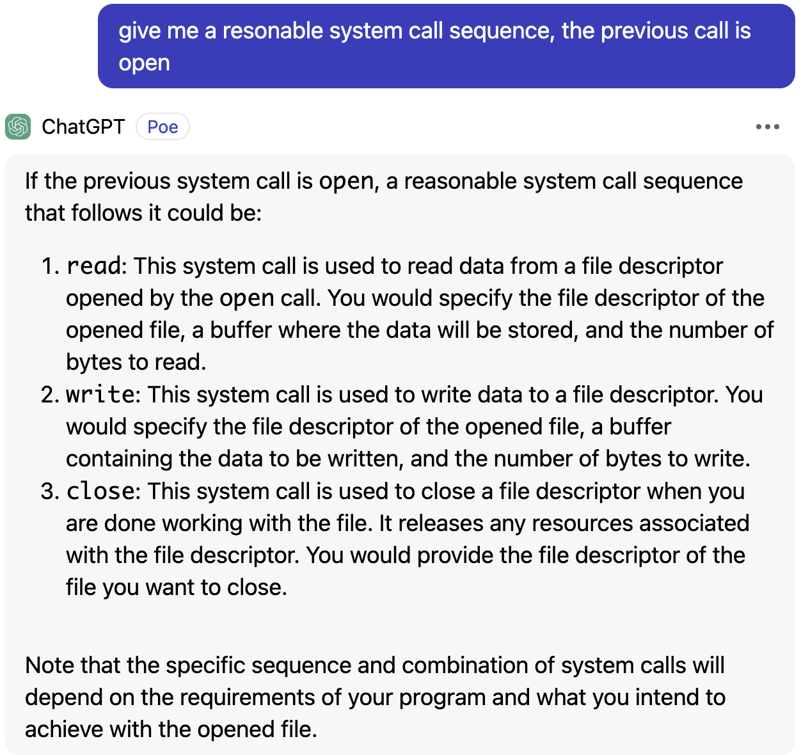
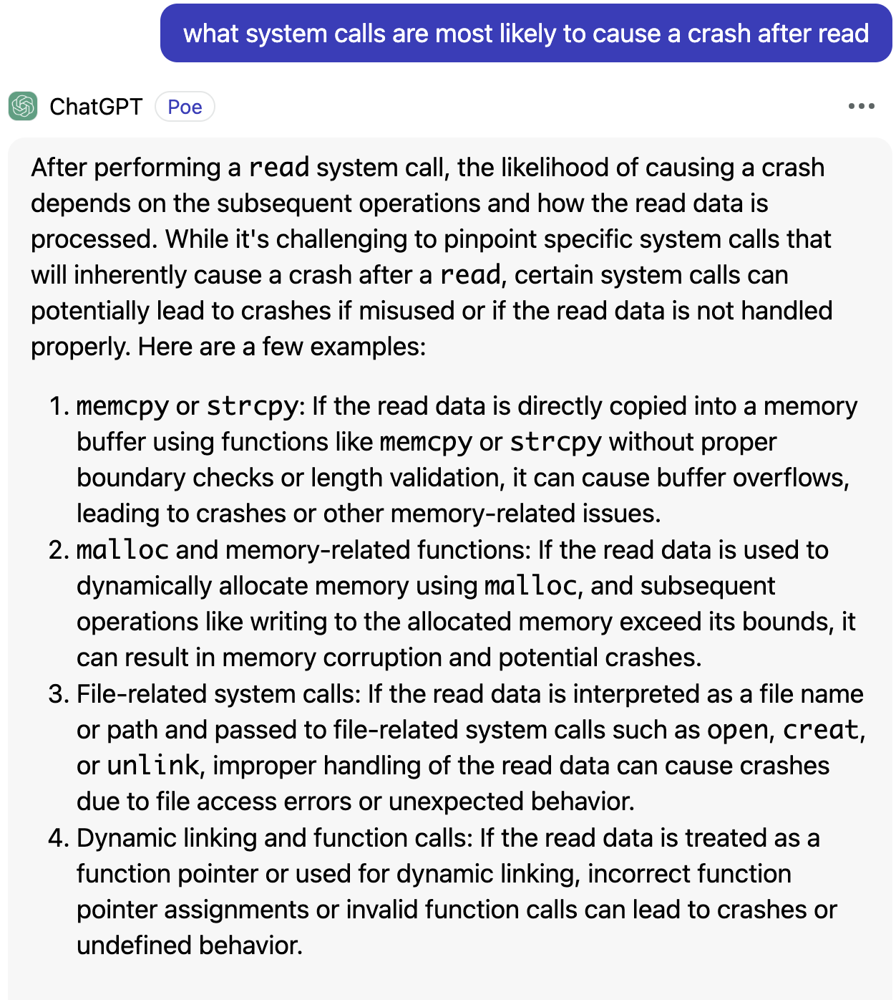
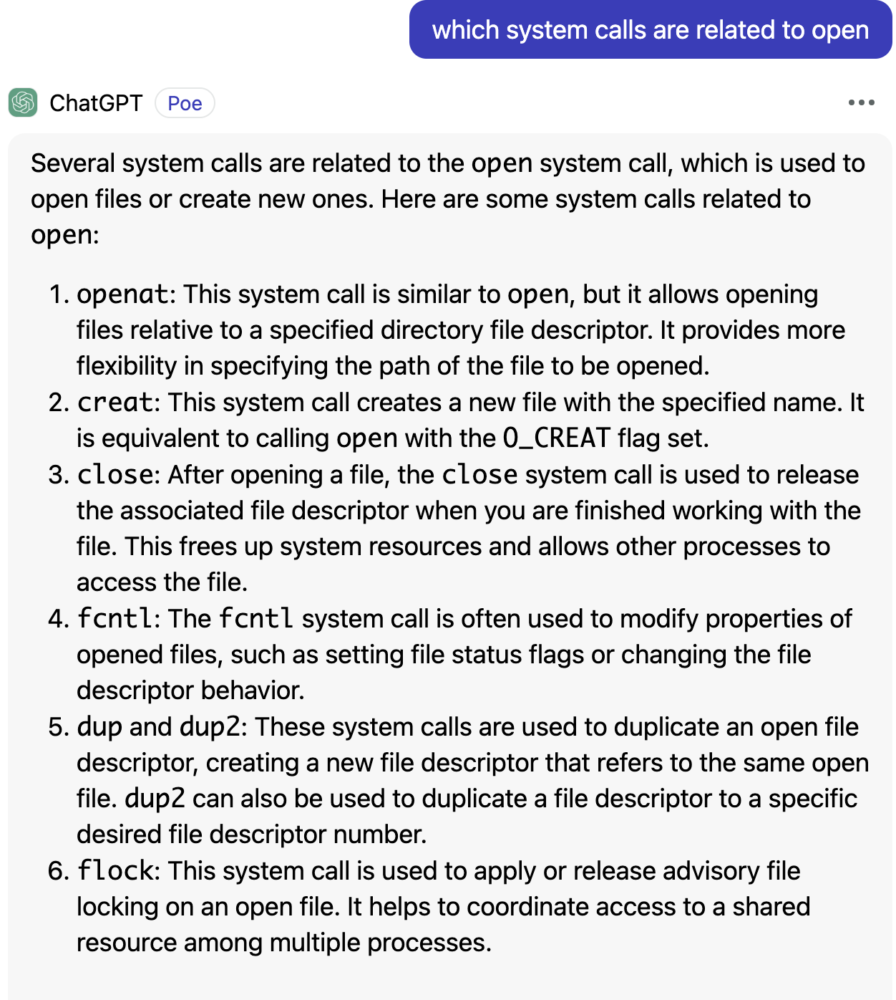

# fuzz-with-LLM

> [reading notes](https://github.com/AmoyCherry/fuzz-with-LLM/blob/main/notes/reading.md)
>
> Idea
>
> [research based on syzkaller (Organized by Google)](https://github.com/google/syzkaller/blob/master/docs/research.md)

## Goals

By leveraging LLM to Generate and systhesis high-quality seeds (syscall sequence) better than manual-ruled ones from original syzkaller.

### Questions

Q1: We can use LLM tools to get syscall relations. But there is a concern need to be addressed.

- Totally random sequences are not expected to get efficiency. And make-sense sequences can get a higher coverage and reach deep code, but it seems like an 'expected behavior' so it may not be easy to find bugs as well. Actually, we don't need to gen standard sequences like a tutorial recommends (e.g. open -> read -> close). We can get related syscalls for given calls as below, a interesting idea is to add variables to standard sequences.

- make-sense sequence for chatGPT:

  

- two examples to get relation

  

  

  

  > The knowledge base can be offline since it's already learned over. That is to say we can query the syscalls relation by a script and draw a relation graph before fuzzing. ~~In addition, to incorperate realtime query, we can avoid some relation missing in pre-learned cache.~~

Q2: How to deal with the quality of seeds gen-ed by LLM?

- LLM can discover explicit relation between syscalls but not good at implicit ones. But the implicit realtion dont show a powerful influence from RLTrace.

Q3: Is it possible and neccesary to make benefits by leverage/combine LLM on mutation stage?

> How does the LLM-based mutator boost the coverage? 
>
> How does the LLM-based mutator handle the inputs feedback?
