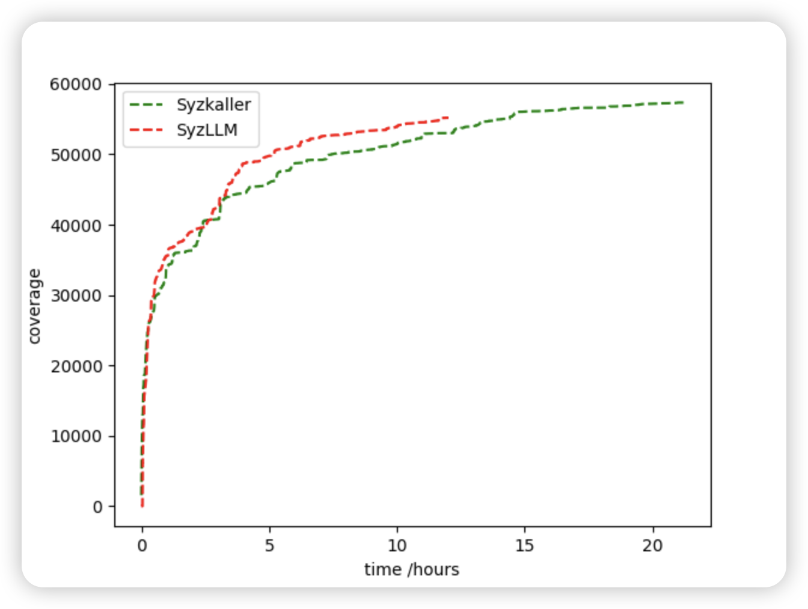
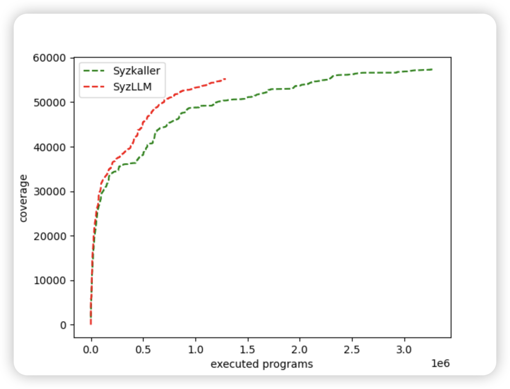

# fuzz-with-LLM

> [reading notes](https://github.com/AmoyCherry/fuzz-with-LLM/blob/main/notes/reading.md)
>
> [idea](https://github.com/AmoyCherry/fuzz-with-LLM/blob/main/notes/idea.md)
>
> [research based on syzkaller (Organized by Google)](https://github.com/google/syzkaller/blob/master/docs/research.md)

## Results

### Coverage over time without corpus
> System: Ubuntu-22.0
> * Memory: 8 G
> * CPUs: 4, Intel(R) Core(TM) i7-9750H CPU @ 2.60GHz
> 
> 
> VM Kernel Version: linux-5.15

1 VM (2 vCPUs and 4G RAM) for 24 hours.

### Coverage over executed programs without corpus
> System: Ubuntu-22.0
> * Memory: 8 G
> * CPUs: 4, Intel(R) Core(TM) i7-9750H CPU @ 2.60GHz
> 
> 
> VM Kernel Version: linux-5.15

1 VM (2 vCPUs and 4G RAM) for 24 hours.

