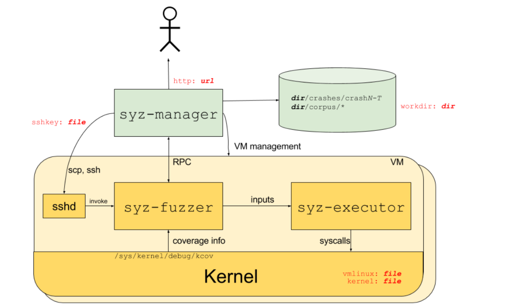

Knowledge Transfer

Pre-trained distillation

mooshine transparent-computing

train by different modules (file, process, ...)

------

Feasibility：

1. 保留位置信息
2. self-attention发现implicit dependencies


https://elisa-builder-00.iol.unh.edu/syzkaller/


**triageQlen** is coming from sys/linux/test and corpus.


lsetxattr$security_capability(&(0x7f0000000680)='./bus/file0\x00', &(0x7f00000003c0)='security.capability\x00', &(0x7f0000000440)=@v3, 0x18, 0x0)

getsockopt$inet_sctp6_SCTP_ASSOCINFO(r0, 0x84, 0x1, &(0x7f00000004c0)={r2}, &(0x7f0000000500)=0x14)

## Source code

> [syz-manager](https://xz.aliyun.com/t/12424?time__1311=mqmhD5AKDIq%2BxQqGXpnxUOxAgbCppLmqx&alichlgref=https%3A%2F%2Fwww.google.com%2F)

### Syz-manager

Init VM Pool 

-> Init Manager and load corpus 

-> Init Dashboard and bench routine

-> Run Dashboard

```
ifconfig eth0 192.168.160.150 up
```

```
ssh -fCNg -L 2345:localhost:2345 -i /home/parallels/fuzz/kernel/image/bullseye.id_rsa -p 10021 -o StrictHostKeyChecking=no -o UserKnownHostsFile=/dev/null root@localhost
```


```
ssh -i /home/parallels/fuzz/kernel/image/bullseye.id_rsa -p 10021 -o "StrictHostKeyChecking no" root@localhost

ssh -i ~/Downloads/share\ folder/kernel-backup/image/bullseye.id_rsa -p 10021 -o "StrictHostKeyChecking no" root@localhost
```

```
scp -r directory/ 
```

```
scp -r parallels@10.211.55.4:/home/parallels/gopath/syzkaller_for_SyzLLM/syz-manager/data/vocab.txt ./data/
```


### syz-fuzzer

```
ssh -N -f -L <local port that fowarding to>:<server ip>:<server port> -p <跳板机端口> <登录跳板机的用户名>@<x1.x1.x1.x1, 跳板机ip> -o TCPKeepAlive=yes

ssh -N -f -L 2345:127.0.0.1:2345 -i /home/parallels/fuzz/kernel/image/bullseye.id_rsa -p 10021 root@localhost -o "StrictHostKeyChecking no, UserKnownHostsFile=/dev/null" TCPKeepAlive=yes 
```


### Enlarge the disk space size of a vm.img

You already have a bullseye.img 2G.

1. Claim new size.

   ```
   sudo dd if=/dev/zero of=bullseye.img bs=1M count=1 seek=4096
   ```

2. Check the new actual size.

   ```
   du -m --apparent-size bullseye.img 
   ```

3. Check fs.

   ```
   sudo e2fsck -f bullseye.img
   ```

4. Resize.

   ```
   sudo resize2fs bullseye.img
   ```

   

## Debug syzkaller

#### Try writing "0" to /proc/sys/kernel/yama/ptrace_scope

```
cd /etc/sysctl.d/
sudo vim 10-ptrace.conf
>>> WRITE 0
sudo sysctl --system -a -p|grep yama
```

> [debug re-remote server](https://www.cnblogs.com/Chary/p/16900516.html)


#### Delete -s -w in makefile and rebuild

#### dlv

10.211.55.3

1. exec

```
sudo /home/parallels/Downloads/GoLand-2022.3.4/plugins/go-plugin/lib/dlv/linux/dlv --listen=:2346 --headless=true --api-version=2 --accept-multiclient exec ./bin/syz-manager -- -config=./cfgs/isolated.cfg
```

2. attach

```
/home/parallels/Downloads/GoLand-2022.3.4/plugins/go-plugin/lib/dlv/linux/dlv attach 129931 --headless --api-version=2 --log --listen=:2346
```

```
/root/download/dlv attach 52827 --headless --api-version=2 --log --listen=:2345
```


## analyze

1. Fuzzing is to generate an unexpected syscall sequence to hit a problem scenario which developer did not find. So a reasonable/make sence sequence may not be efficient? 
   1. follow up: what about insert some random calls into a reasonable sequence?

## setup env

> [link1](https://snappyjack.github.io/articles/2020-05/%E4%BD%BF%E7%94%A8Syzkaller%E8%BF%9B%E8%A1%8C%E5%86%85%E6%A0%B8fuzz): install dependencies;
>
> [link2](https://m.freebuf.com/vuls/322630.html): set .config;
>
> [link3](https://github.com/google/syzkaller/blob/master/docs/linux/troubleshooting.md): "Failed to start Raise network interfaces"
>
> https://www.cnblogs.com/m00nflower/p/16474927.html

## syzkaller

### overview

- sys-executor receives inputs generated by syz-fuzzer (syscalls), runs them, and returns results.



syz-fuzzer/fuzzer.go defines RPC client and several request APIs.

syz-manager/rpc.go defines RPC server and corresponding handlers.


### Syscall description language

> [official guide](https://github.com/google/syzkaller/blob/master/docs/syscall_descriptions_syntax.md)
>
> [sample](https://github.com/google/syzkaller/blob/master/sys/linux/sys.txt)

use to manipulate the syscall sequence of fuzz.

Process:

.txt (description file) ---syz-extract--> .const


Sytax

```
syscall$tested_module(para_name1 para_type[values], ...) return value

e.g. :
open$testxy(file ptr[in, string["/proc/test1"]], flags flags[proc_open_flags], mode flags[proc_open_mode]) fd

read$testxy(fd fd, buf buffer[out], count len[buf]) len[buf]

write$testxy(fd fd, buf buffer[in], count len[buf]) len[buf]

proc_open_flags = O_RDONLY, O_WRONLY, O_RDWR, O_APPEND, FASYNC, O_CLOEXEC, O_CREAT, O_DIRECT, O_DIRECTORY, O_EXCL, O_LARGEFILE, O_NOATIME, O_NOCTTY, O_NOFOLLOW, O_NONBLOCK, O_PATH, O_SYNC, O_TRUNC, __O_TMPFILE

proc_open_mode = S_IRUSR, S_IWUSR, S_IXUSR, S_IRGRP, S_IWGRP, S_IXGRP, S_IROTH, S_IWOTH, S_IXOTH
```


Usually a device node corresponds to a description file


#### install ifconfig in image

```
apt-get update
apt-get install ifconfig
```


> ```
> sudo ln -s /home/parallels/goroot/bin/* /usr/bin/
> 
> sudo vim ~/.bashrc
> 
> export GOPATH=/home/parallels/gopath 
> export GOROOT=/home/parallels/goroot
> export PATH=$GOPATH/bin:$PATH
> export PATH=$GOROOT/bin:$PATH
> ```

### An example: add a module to target kernel and create crashes

#### 1. check syz-extract and syz-sysgen exist in syzkaller/bin

if not, run

```
make bin/syz-extract
make bin/syz-sysgen
```


#### 2. add and compile new module

1. create file in linux/drivers/char

   ```
   #include <linux/init.h>
   #include <linux/module.h>
   #include <linux/proc_fs.h>
   #include <linux/uaccess.h>
   #include <linux/slab.h>
   
   
   static int proc_open (struct inode *proc_inode, struct file *proc_file)
   {
       printk(":into open!\n");
       return 0;
   }
   
   static ssize_t proc_read (struct file *proc_file, char __user *proc_user, size_t n, loff_t *loff)
   {
       printk(":into read");
       return 0;
   }
   
   static ssize_t proc_write (struct file *proc_file, const char __user *proc_user, size_t n, loff_t *loff)
   {
       char *c = kmalloc(512, GFP_KERNEL);
       copy_from_user(c, proc_user, 4096);
       printk(":into write!\n");
       return 0;
   }
   
   static struct proc_ops test_op = {
       .proc_open = proc_open,
       .proc_read = proc_read,
       .proc_write = proc_write,
   };
   
   static int __init mod_init(void)
   {
       proc_create("test1", S_IRUGO|S_IWUGO, NULL, &test_op);
       printk(":proc init over!\n");
       return 0;
   }
   
   module_init(mod_init);
   ```

   

2. vim char/KCconfig

   ```
   config TESTXY_MODULE
           tristate "heap overflow test"
           default y
           help
             This file is to test a buffer overflow
   ```


3. vim char/Makefile

   ```
   obj-$(CONFIG_TESTXY_MODULE) += testxy.o
   ```


4. re-compile kernel

   ```
   make clean
   make -j4
   ```

   

   check `Device Drivers -> Heap Overflow Test`

   ```
   make menuconfig
   ```


5. check added module in VM

   ```
   # check if exist
   ls /proc/test1
   # check load info
   dmesg | grep "proc init"
   ```

   

#### 3. customize description for new added module

1. add new file to syzkaller/sys/linux/proc_testxy.txt

   ```
   include <linux/fs.h>
   
   open$testxy(file ptr[in, string["/proc/test1"]], flags flags[proc_open_flags], mode flags[proc_open_mode]) fd
   read$testxy(fd fd, buf buffer[out], count len[buf]) len[buf]
   write$testxy(fd fd, buf buffer[in], count len[buf]) len[buf]
   
   proc_open_flags = O_RDONLY, O_WRONLY, O_RDWR, O_APPEND, FASYNC, O_CLOEXEC, O_CREAT, O_DIRECT, O_DIRECTORY, O_EXCL, O_LARGEFILE, O_NOATIME, O_NOCTTY, O_NOFOLLOW, O_NONBLOCK, O_PATH, O_SYNC, O_TRUNC, __O_TMPFILE
   proc_open_mode = S_IRUSR, S_IWUSR, S_IXUSR, S_IRGRP, S_IWGRP, S_IXGRP, S_IROTH, S_IWOTH, S_IXOTH
   ```

   

2. syz-extract -> .const

   gen extract and sysgen if not exist

   ```
   make bin/syz-extract
   make bin/syz-sysgen
   ```

   ```
   bin/syz-extract -os linux -arch amd64 -sourcedir "/home/parallels/fuzz/kernel/linux-5.15.15" proc_testxy.txt
   ```

   

3. re-compile syzkaller

   ```
   make
   ```


4. check .config in syzkaller

   ```
   "enable_syscalls":[
           		"open$testxy",
           		"read$testxy",
           		"write$testxy",
           		"close"
        ],
   ```


5. run VM and syzkaller

   ```
   // 1. run VM
   cd /home/parallels/fuzz/kernel/image
   ./boot-net.sh
   
   // 2. run syzkaller
   cd /home/parallels/gocode/src/syzkaller
   ./syz-manager --config CONFIG-PATH
   ```

   