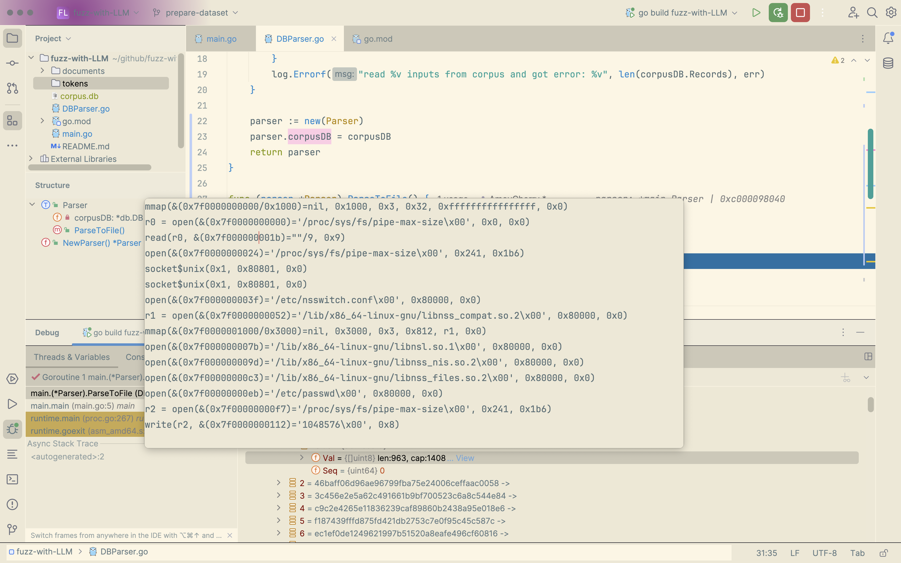

## Choose a transformer

> ### Requirements
>
> 1. balance between over- and underfitting
>    - "If the model’s performance on the validation data starts to degrade while the training performance remains high, it’s a signal that overfitting may be occurring."

| LLM AI Model | Parameters       | Year |
| :----------- | :--------------- | :--- |
| TinyBERT4    | **14.5 million** | 2020 |
| BERT         | 340 million      | 2018 |
| GPT-2        | 1.5 billion      | 2019 |
| Meena        | 2.6 billion      | 2020 |
| GPT-3        | 175 billion      | 2020 |
| LaMDA        | 137 billion      | 2022 |
| BLOOM        | 176 billion      | 2022 |

------

## Train SyzLLM

> ref:
>
> [How to Train BERT from Scratch](https://thepythoncode.com/article/pretraining-bert-huggingface-transformers-in-python)
>
> [huggingface](https://huggingface.co/blog/pretraining-bert#3-preprocess-the-dataset)

### 1. Prepare dataset

### 1.1 Mooshine

#### build mooshine

NOTE:

1. set GOPATH at first. E.g. GOPATH = $HOME/gocode
2. For the error "can not find syzkaller/../ifuzz/generated", copy all files under ../ifuzz/x86/ to ../ifuzz.

#### run and get corpus.db

### 1.2 Syzkaller

Download corpus.db from [google drive](https://groups.google.com/g/syzkaller/c/77ObybwNnig?pli=1).

### 1.3 darpa (To be start)

https://github.com/darpa-i2o/Transparent-Computing

### 1.4 Parse corpus.db to token files

A trace in corpus.db looks like below. It's consist of several syscalls with arguments (tokens) and we get the number of **120k** sequences now.

**The format of the tokens need a explanation.**

### 2. Train a tokenizer

### 3. Train the model
