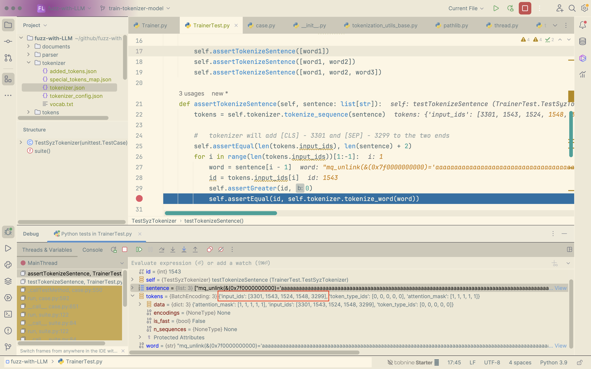
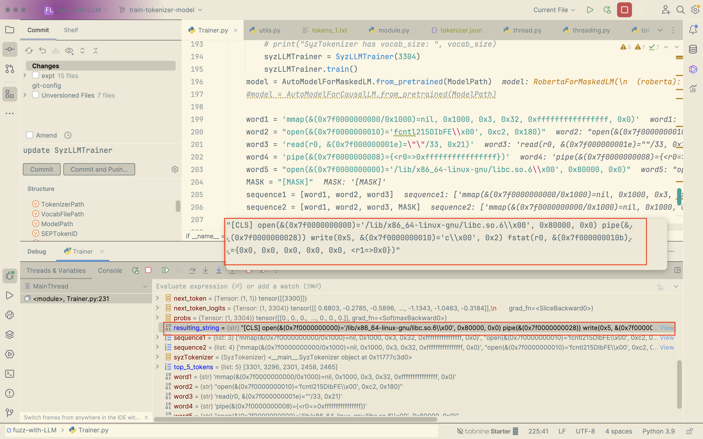

### distil

| batch_size | learning_rate | dropout |
| :--------- | ------------- | ------- |
|            |               |         |
|            |               |         |
|            |               |         |

### bert

|               result               | batch_size | learning_rate | hidden_size | num_attention_heads |      |
| :--------------------------------: | :--------: | :-----------: | :---------: | :-----------------: | :--: |
|     ❌ ❌ Same answers at top1.      |     2      |     1e-5      |     256     |         16          |      |
|                 ✅❌                 |     2      |     1e-6      |     128     |          8          |      |
|                 ✅✅                 |     2      |     1e-6      |     128     |         16          |      |
|     ❌ ❌ Same answers at top1.      |     2      |     1e-5      |     64      |          4          |      |
| ❌ [PAD]    ❌ Same answers at top1. |     2      |     1e-6      |     64      |          8          |      |


## Choose a transformer

> ### Requirements
>
> 1. balance between over- and underfitting
>    - "If the model’s performance on the validation data starts to degrade while the training performance remains high, it’s a signal that overfitting may be occurring."

| Model     | Parameters       | Year |
| :-------- | :--------------- | :--- |
| TinyBERT4 | **14.5 million** | 2020 |
| BERT      | 340 million      | 2018 |
| GPT-2     | 1.5 billion      | 2019 |
| Meena     | 2.6 billion      | 2020 |
| GPT-3     | 175 billion      | 2020 |
| LaMDA     | 137 billion      | 2022 |
| BLOOM     | 176 billion      | 2022 |

------


corpus size > parameter size > token size


## Train SyzLLM

> ref:
>
> [How to Train BERT from Scratch](https://thepythoncode.com/article/pretraining-bert-huggingface-transformers-in-python)
>
> [huggingface](https://huggingface.co/blog/pretraining-bert#3-preprocess-the-dataset)
>
> [train bert](https://towardsdatascience.com/how-to-train-a-bert-model-from-scratch-72cfce554fc6)

### 1. Prepare dataset

### 1.1 Mooshine

#### build mooshine

NOTE:

1. set GOPATH at first. E.g. GOPATH = $HOME/gocode
2. For the error "can not find syzkaller/../ifuzz/generated", copy all files under ../ifuzz/x86/ to ../ifuzz.

#### run and get corpus.db

### 1.2 Syzkaller

Download corpus.db from [google drive](https://groups.google.com/g/syzkaller/c/77ObybwNnig?pli=1).

### 1.3 darpa (To be start)

https://github.com/darpa-i2o/Transparent-Computing

### 1.4 Parse corpus.db to token files

A trace in corpus.db looks like below. It's consist of several syscalls with arguments (tokens) and we get the number of **120k** sequences now.

> [An explanation](https://www.collabora.com/news-and-blog/blog/2020/03/26/syzkaller-fuzzing-the-kernel/) about the syscall format.


### 2. Train a tokenizer
Syztokenzier is different from other tokenizers because we already split the text into tokens (separate each syscall with \n in token files), so we are not expected to do word segmentation in the process of training. 

We can get these token files by `Parser` and `Corpus.db`, and train a tokenizer for syscalls as below.

```python
bert = BertTokenizerFast('vocab.txt')
bert.save_pretrained(ModelPath)
```

For now, we can tokenize a syscall sequence.



### 3. Train the model

3.1 Building the DataLoader 
> #### NOTE
> 1. file.read().split('[SEP]\n') will left a blank str '' for each sequence. Now it's handled by the `adjust_format` method.
> 2. Sequences have different length so we have to set the three parameters of `max_length=16`, `padding='max_length'` and `truncation=True` to resolve `ValueError: expected sequence of length 5 at dim 1 `.

3.2 Training

> **Boost the accuracy!**
>
> 1. Relations at two levels: syscall type and parameters.



