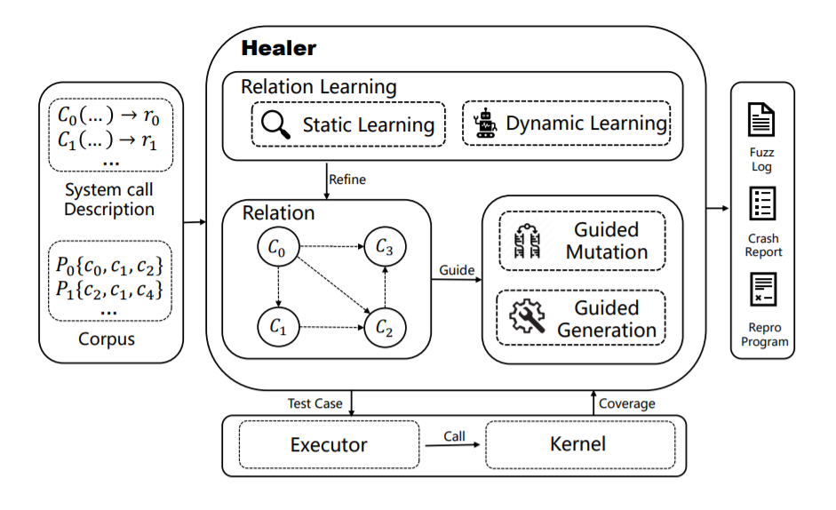
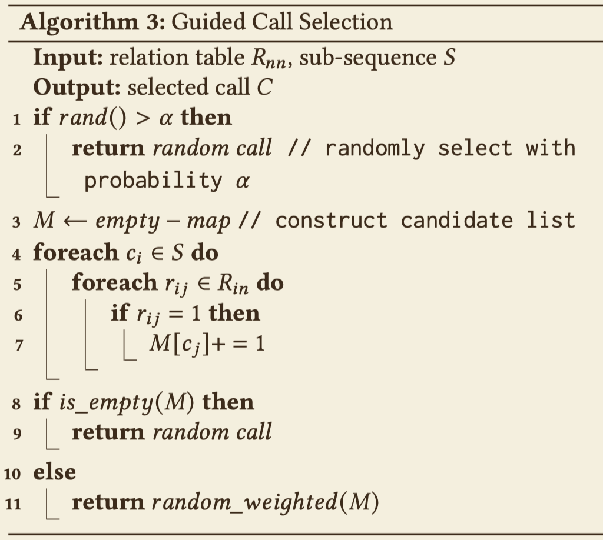
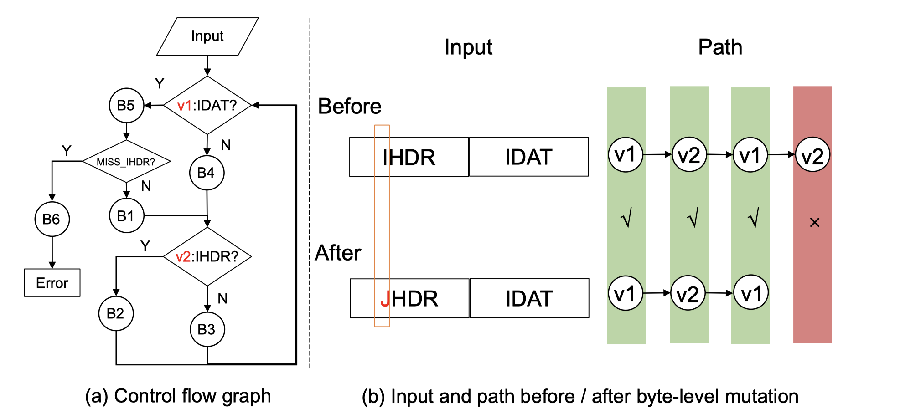
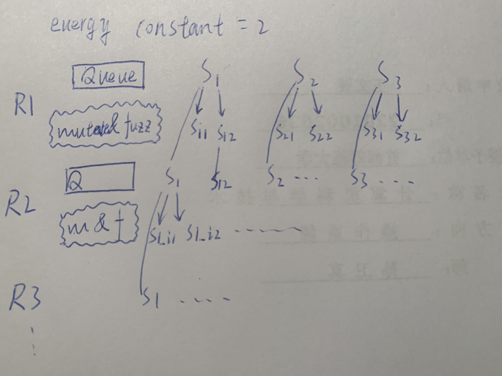
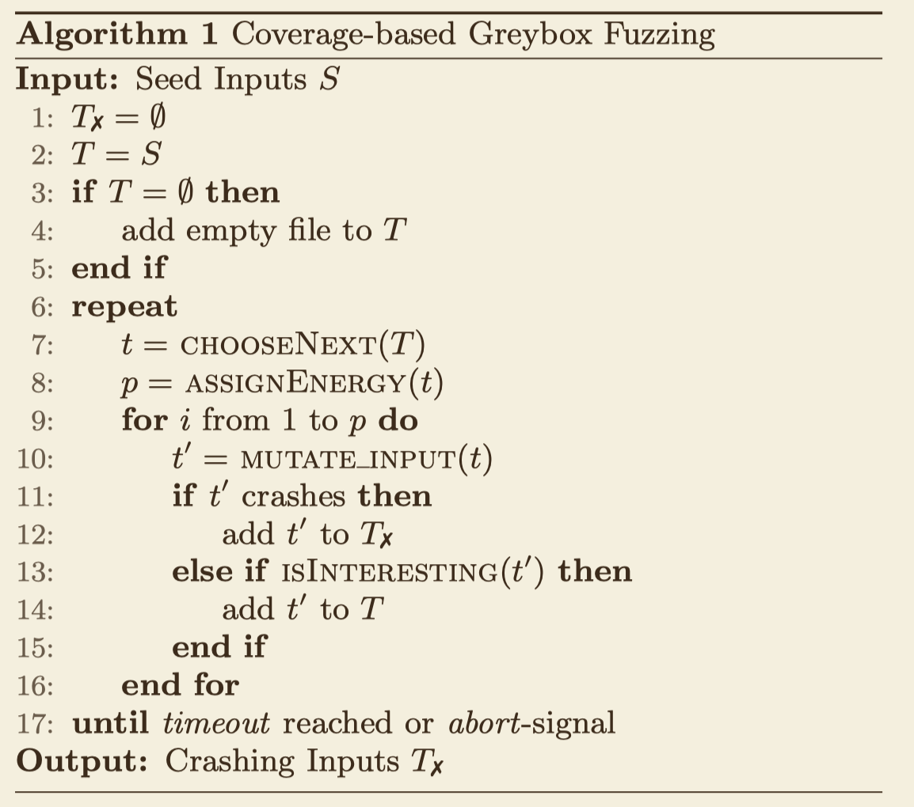
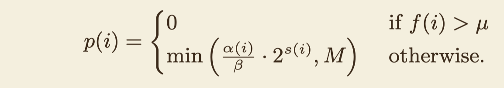
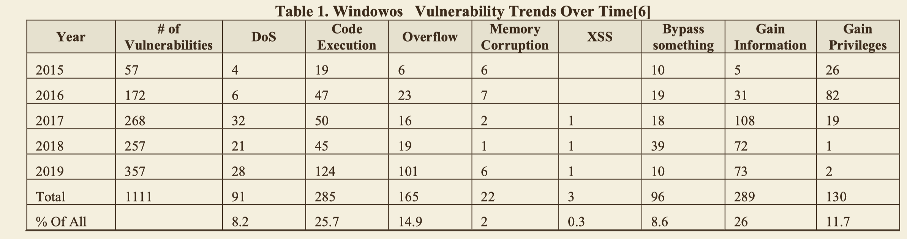
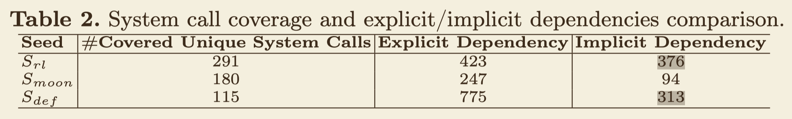
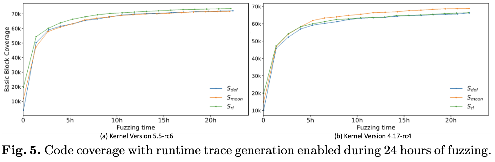

## Healer - SOSP 2021

> [HEALER - Relation Learning Guided Kernel Fuzzing](http://www.wingtecher.com/themes/WingTecherResearch/assets/papers/healer-sosp21.pdf)

### Idea

"In order to reduce the search space and improve fuzzing efficiency, we propose to consider the **influence relations** between system calls during test case **generation** and **mutation**."

### Design



#### static learning

analyze return values and params by detecting syzlang files.

- R(i, j) = 0: no relation.
- R(i, j) = 1: Ci -> Cj, which means Ci's output (func return value or ptr params which its type same to return value's) is Cj's input.

#### dynamic learning

- algo1 - Sequence minimazition: for a syscall sequence, try to delete every syscall and check if the coverage is smaller, if so, the deleted syscall is critical so need to be retained. And the syscall should be deleted if the coverage has no change. 
  - The only goal is to delete the syscalls which don't impact the coverage so that **reduce the search space**.
- algo2 - relation learning: 
  1. traverse each syscall in the sequence in turn;
  2. assume (Ci, Cj) are two adjacent calls (like a two size window slide on the sequence), if Cj's coverage is to be smaller atfer delete Ci, we can be sure that there is a relation between Ci and Cj, so that R(i, j) = 1.

#### relation table-guided generation and mutation



At the begining, the relation infomation has not been colletcted, so there is a high probability of $a$ to choose a random call.


## PATA - S&P 2022

> [PATA: Fuzzing with Path Aware Taint Analysis](http://www.wingtecher.com/themes/WingTecherResearch/assets/papers/sp22.pdf)

### Goals

Enhance the efficiency that identify and leverage the influencing input bytes (critical bytes) when encountered loops.

### BG

#### the influencing input bytes

The specific bytes or portions of the input data that have the potential to <u>affect the behavior of the target program</u>.

- passing through different if-conditions and trigger different code paths;
- uncover vulnerabilities or cause unexpected behavior.

Benefits: helps guide the fuzzer towards exploring different program paths and increasing the chances of discovering vulnerabilities.

**Follow up:**

*How to use it to increase the chance of uncover vnbs?*

- guided the mutation process, i.e. focus on operating the influencing input bytes.


#### variable occurrence

```c++
// define variable
int name = get();

// occurrence 1
if (name ...) { }

// occurrence 2
func(C)
```


#### RVS

An excution path represent by a list of variable occurrences e.g. V1 -> V2 -> V1.

### Motivition and Example



*When execution paths alter after input perturbation, PATA utilizes a matching algorithm to determine which constraint variable occurrence after perturbation matches with a constraint variable occurrence in the original path. Matched pairs are marked with Xin the figure.*


### Basic Idea

1. Collect RVS of a excution path. 
   1. Collect occurrences of each variable;   
   2. Gen a original input;
   3. Excute input and records values into RVS along the path. 
2. Perturb input bytes and records a list of new values into RVS.
   - Maybe not every variable in RVS could records a new value since a potential excution path could be explored.

3. Match the variable occurrences between two RVSs to check if a new excution path is explored.
4. Compare the values between the matched occurrences to get a list of whether the altered byte is critical to every occurrence (nodes of a path: V1 -> V2 -> V1).


### Comments

Improve the accuracy of locate critical bytes for each variable occurrence with limited memory cost added compare to conventional methods.


## AFLFast - CCS 2016

### limitations of conventional methods (AFL) 



#### AFL algorithm



#### defects

the two methods in line 7 and 8 could be improved.

1. traditional methods dont consider the number of gen-ed inputs (energy) , so ofen cause too much `energe` is assigned for some crash paths which don't required such more, and insufficient for other crash paths which need more. 
2. traditional methods dont consider the order that choose seeds to mutate and fuzz from the queue.

### Idea

make the inputs gen-ed from the low density region can be excute first.

> $t_i$ : a seed which been choosen and will exercises path $i$.
>
> $s(i)$ : the number of $t_i$ has been selected.
>
> $f(i)$ : the number of gen-ed inputs that exercise path $i$
>
> $u$ : the mean number of $f(i)$
>
> $M$ : upper bound of $P$ for current iteration 
>
> the meaning of path $i$ seems equal to 'seed'.

#### Power Schedules

##### AFL

$a(i)$ : depending on the execution time, block transition coverage, and creation time of $t_i$ without consider the frequency of the choosen seed.

$B$ : a constant to reduce the gen-ed inputs size.


##### Cut-Off Exponential (COE)




##### The exponential schedule (FAST)

1. inversely proportional to the amount of fuzz $f(i)$ that exercises path $i$ includes $f(i) > u$.
2. if $t_i$ has been picked up many times (with a high $s(i)$) we could be more confident that $i$ live in a low-density region.


Understanding the term *Fast*

AFLFast can only explore bugs that AFL can and just finds same number bugs in a shorter time, since AFLFast doesn't modify the AFL'mutator. This is called *merely impact AFL’s efficiency (i.e., #paths explored per unit time), not its effectiveness (i.e., #paths explored in expectation).*

## FastSyzkaller: Improving Fuzz Efficiency for Linux Kernel Fuzzing - SCSET 2018

> not so good paper

### Idea

#### Prepare efficient seeds

1. Run the original Syzkaller to fuzz the Linux kernel;
2. Obtain and separate thousands of sequential syscalls that trigger crashs or not;
3. apply N-Gram model to the test inputs, collect a set of vulnerable sequential system call patterns with length of n system calls;

#### Mutating

Fast-syzkaller can only insert reasonable syscalls with high priorities after the given test inputs, cannot remove or mutate any of the given syscalls in the syscall sequence.


## A Systemic Review of Kernel Fuzzing

### Brief

#### Introduction

##### The challenge to fuzz OS kernels compare to fuzz softwares runing on user space

1. How to capture the crash and record the system crash information when the OS crashed.
2. Fuzzers usually run on ring 3 layer and how to interact with the system kernel running on ring 0 layer.
3. How to minimize performance overhead in testing

#### the number of reported vulnerabilities in the Windows 10 kernel by category



#### Vulnerability Discovery Techniques

##### static analysis


##### dynamic analysis


##### symbolic excution

> This method consider some part of the inputs have heavy impact on the flow of some conditional branches. Some specific component of the inputs could trigger corresponding program path. By collecting these relation knowledge, the fuzzer can generate target inputs that adhere to specific conditions or behaviors of the program.
>
> Very suit for strcutured inputs.

Analyzing a program to determine which inputs cause each part of the program to execute.

For expressions and variables in the program, the expressions are represented by those symbols, and for the possible outcomes of each conditional branch, the constraints are represented by those symbols.

#### Knowledge-based Fuzzer 

**tsys fuzzer**: random-based fuzzer which gen garbage data.

**Trinity**: the generated random data is converted to the type which acceptable to the kernel API.

> it's a step toward intelligently fuzzing, but with too strong randomness yet. E.g., `read` can only accept fd from `open`.

**IMF**: can learn the reasonable API execution order, established an API model based on the call and the input-output relationship dependency between APIs.

**Moonshine**: learn syscalls order from real-world software.

**HFL**

1. Verify syscall sequences with symbolic execution and get the real system call dependencies.
2. *Convert the indirect control flow into direct control flow while guaranteeing conditional branch semantics. After the transformation, the code of the kernel in a deep position can be run directly.*
3. *Identify the nested parameters of the system calls.*

#### Coverage-guided Fuzzer

##### TriforceAFL

1. An updated version of AFL.
2. Like syskaller, it runs the target kernel on a set of QEMU virtual machines.
3. unlike syskaller, it capture **edge info** instead of build kernel with coverage support. So it could fuzz almost anything that can run under QEMU's x64 full system emulation mode.

##### kAFL

Adopt hypervisor and Intel's Processor Trace (PT) technology to respond the challenge of critical performance overhead when a kernel which run a fuzzer process occur a crash.

##### Unicorefuzz

A CPU emulator-based fuzzer.

## RLTrace: Synthesizing High-Quality System Call Traces for OS Fuzz Testing - ISC 2023

### Idea

Learning (explicit and implicit) dependencies between syscalls by RL with coverage as its reward. And systhesis 'high-quality' seeds by the learned dependencies.

### Current limitations and contributions

1. **Syzkaller's** rule-based approach reducing the fuzzer's **efficiency** in exploring **individual system calls**; Moonshine, which improves fuzzing efficiency by analyzing <u>system call logs of OS utility programs</u> to detect dependencies across different system calls and generate simplified system call traces. But Moonshine covers only 53.9% of the system calls supported by Syzkaller. 

- system call traces are synthesized from scratch using RL-based methods to achieve high code coverage. (The paper did not clarify the reason of why the RL method could promise a high coverage for individual syscalls and much more implicit depencies).

2. many of its generated traces are lengthy and repetitive and cannot achieve highly effective fuzz testing.

- We report that traces with **five** system calls can **outperform** other settings with sufficient time of fuzzing (after about 27,000 seconds).

### Results





### Explicit dependencies

Parameter and return value-level dependencies.

> similar to Healer - static learning;

### Implicit dependencies


### Comments

The paper highlight a work that discover more implicit dependencies than other fuzzers, and it should discuss the contribution of these implicit depen. The experiment could be simple by set a control group which remove all the implicit depen. which other fuzzers have not found.

### Implementation

1. built on Tensorflow and Python.

2. modified [Syzkaller](https://en.wikipedia.org/?curid=71558241) to improve efficiency by introducing an agent module that reduces the need for rebooting the virtual machine (VM) instance, significantly decreasing training time